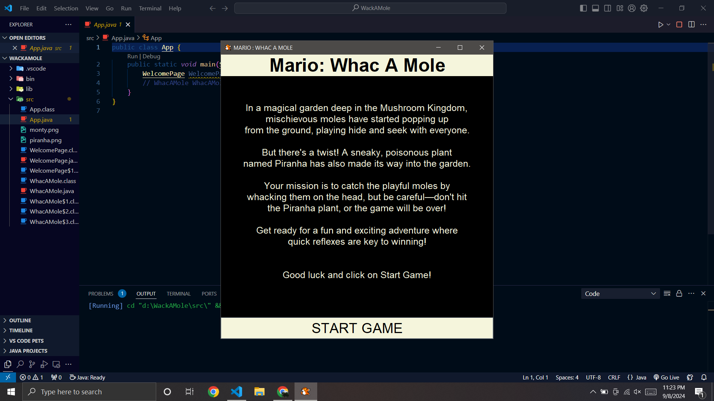
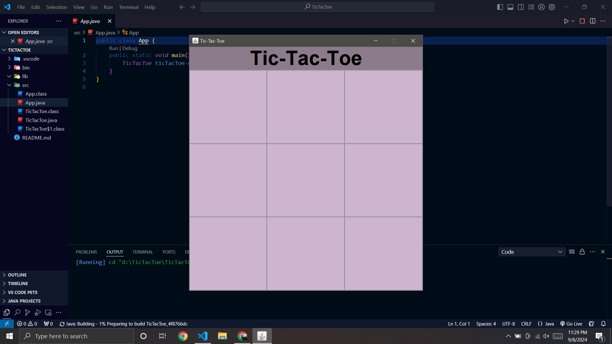
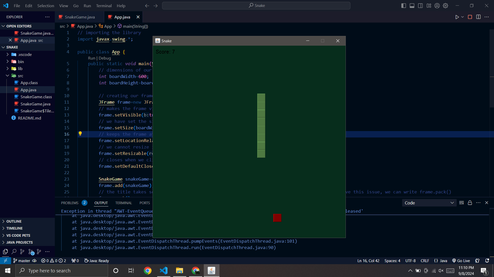

## 🎮 EXE-lent Games  

**PC Gaming, Zero Compromises**  

🚀 **EXE-lent Games** is a collection of **fun and exciting PC games** available for download, along with **browser-based online games** that you can play instantly. Whether you're looking to test your reflexes with **Whac-A-Mole**, challenge your mind in **Tic-Tac-Toe**, or battle enemies in a **2D Space Shooter**, we’ve got something for everyone!  

## 🔥 Features  

- **Downloadable Java-based PC Games:** 🎲  
  - **Whac-A-Mole** 🛠️  
  - **Tic-Tac-Toe** ❌⭕  
  - **Snake Game** 🐍  
- **Play Online Games in Browser:** 🌍  
  - **2D Space Shooter** 🚀  
  - **Solar System Explorer** 🌌  
- **User-Friendly Interface**: Simple and intuitive UI for a seamless gaming experience.  
- **Lightweight & Fast**: Small game sizes with smooth performance.  

---

## 📥 Download & Play  
1. Click on the **Download Now** button for your favorite game.  
2. Ensure you have **Java installed** on your PC.  
3. Run the `.jar` file and start playing!  

### 🎮 Play Online  
1. Open your favorite web browser (Chrome, Firefox, Edge, Safari).  
2. Click on the **Play Now** button for any online game.  
3. Enjoy instant gaming—no installation required!  
---

## 🖥️ System Requirements  
### ✅ For Downloadable Games  
- **Operating System:** Windows, macOS, Linux  
- **Java:** JDK 11+ (Check using `java -version`)  
- **Storage:** Minimal (under 50MB per game)  

### 🌐 For Online Games  
- **Modern Web Browser**  
- **JavaScript Enabled**  
- **Stable Internet Connection**  

---
## 📸 Screenshots  

### **Whac-A-Mole**  
  

### **Tic-Tac-Toe**  
  

### **Snake Game**  
  

---

## 💻 Installation Guide (For Java Games)  

1. **Check Java Installation**  
   ```sh
   java -version
   ```  
   If Java is not installed, download it from [here](https://www.oracle.com/java/technologies/javase-jdk11-downloads.html).  

2. **Run the Game**  
   - Double-click the `.jar` file OR  
   - Open terminal/cmd in the game folder and run:  
     ```sh
     java -jar GameName.jar
     ```  
---

## 🤝 Contribution  
Want to improve or add new games? Feel free to fork this repository, make changes, and submit a pull request!  
1. **Fork the repository**  
2. **Clone the repo**  
   ```sh
   git clone https://github.com/your-username/EXE-lent-Games.git
   ```  
3. **Make changes & commit**  
   ```sh
   git add .
   git commit -m "Added a new game"
   ```  
4. **Push & create a Pull Request**  
   ```sh
   git push origin main
   ```  
---
## 📜 License  

This project is open-source and available under the **MIT License**.  
---
## 💖 Created By  
👩‍💻 **Aastha Bhatia**  
🚀 Happy Gaming! 🎮  

---

This README is structured to be **clear, professional, and engaging**, with sections for **features, installation, system requirements, and contribution**. Let me know if you want any modifications! 🚀
